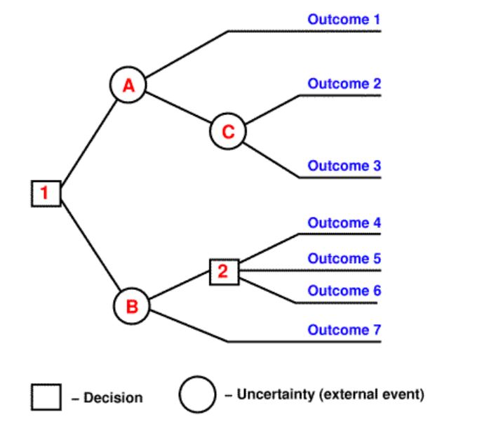

# Relative Defect Proneness
  
 CSC-510 Software Engineering
 Project Report 1-b
  
# Goals

**What is data mining?**
- Data Mining is an analytic process designed to explore data (usually large amounts of data - typically business or market related - also known as "big data") in search of consistent patterns and/or systematic relationships between variables, and then to validate the findings by applying the detected patterns to new subsets of data.

**Our goals for this data mining project**
- The hypothesis laid out in the ['Theory of relative defect proneness'](http://link.springer.com.prox.lib.ncsu.edu/article/10.1007%2Fs10664-008-9080-x) proposing that smaller modules are more defect prone than larger modules in a software application interests us, we would like to use this as background to apply various methods and test them.
- We used training data to generate and tune the model, and then tested the model on the testing data to prove our model works.
- In data mining, area under the curve (AUC) of PD (proportion of bug detected) and LOC (Line of Code) is an important measurement. The larger the AUC, the better the model. 
- According to Arisholm and Briand, if a data miner works, PD must be greater than LOC, which is mimnial curve (y=x).
- So, our goal is to make AUC of PD and LOC as large as possible.
- We implemented our own Which method to see if our own method is better than other standard methods like SVM, decision tree.

# Background

**Blind spots management**
- Building software is expensive, so, it is very important to use the limited quality assurance budgets on the most defective part. Now, how to find these parts are the major concern. 
In a complex software, the project artifacts that hasn't attracted the attention of QA activities are called blind spots. They can not be avoided due to the limited budget. Thus, "the standard practice should be augmented with a lightweight sampling policy that (a) explores the rest of the software and (b) raises an alert on parts of the software that appear problematic." 

**Lightweight sampling**
- To build a lightweight sampling policy, we adopted data mining over static code features method. The data sets we used usually contains static code features like wmc, dit, noc, cbo, loc, bug and so on. Originally, the bug column stands for the number of bugs found in this part, we first converted this column to boolean values based on the number of bugs. We then used statistical combinations of other feaures on the testing sets to predict for the bug boolean value. 

# Methods
We used 5 methods to generate models and compared them according on the result we got.

**Naive Bayesian**
- Naive Bayes is a simple technique for constructing classifiers: models that assign class labels to problem instances, represented as vectors of feature values, where the class labels are drawn from some finite set. It is not a single algorithm for training such classifiers, but a family of algorithms based on a common principle: all naive Bayes classifiers assume that the value of a particular feature is independent of the value of any other feature, given the class variable. For example, a fruit may be considered to be an apple if it is red, round, and about 3" in diameter. A naive Bayes classifier considers each of these features to contribute independently to the probability that this fruit is an apple, regardless of any possible correlations between the color, roundness and diameter features.

**Decision Tree**
- Decision tree builds classification or regression models in the form of a tree structure. It breaks down a dataset into smaller and smaller subsets while at the same time an associated decision tree is incrementally developed. The final result is a tree with decision nodes and leaf nodes. A decision node (e.g., Outlook) has two or more branches (e.g., Sunny, Overcast and Rainy). Leaf node (e.g., Play) represents a classification or decision. The topmost decision node in a tree which corresponds to the best predictor called root node.

**Random Forest**
- Random Forests grows many classification trees. To classify a new object from an input vector, put the input vector down each of the trees in the forest. Each tree gives a classification, and we say the tree "votes" for that class. The forest chooses the classification having the most votes (over all the trees in the forest).

**SVM**
- In machine learning, support vector machines (SVMs, also support vector networks) are supervised learning models with associated learning algorithms that analyze data and recognize patterns, used for classification and regression analysis. Given a set of training examples, each marked as belonging to one of two categories, an SVM training algorithm builds a model that assigns new examples into one category or the other, making it a non-probabilistic binary linear classifier. An SVM model is a representation of the examples as points in space, mapped so that the examples of the separate categories are divided by a clear gap that is as wide as possible. New examples are then mapped into that same space and predicted to belong to a category based on which side of the gap they fall on.
 
**Which**

# Results

# Discussion

# Conclusion

# Future Work

# References

## Data source:
http://openscience.us/repo/defect/ck/
http://www.statsoft.com/Textbook/Data-Mining-Techniques
Menzies, Tim, et al. "Defect prediction from static code features: current results, limitations, new approaches." Automated Software Engineering 17.4 (2010): 375-407.
Koru, A. Günes, et al. "Theory of relative defect proneness." Empirical Software Engineering 13.5 (2008): 473-498.
http://en.wikipedia.org/wiki/Naive_Bayes_classifier
http://www.saedsayad.com/decision_tree.htm
https://www.stat.berkeley.edu/~breiman/RandomForests/cc_home.htm#intro
http://en.wikipedia.org/wiki/Support_vector_machine
