# Relative Defect Proneness
  
 CSC-510 Software Engineering
 Project Report 1-b
  
# What is data mining?
- Data Mining is an analytic process designed to explore data (usually large amounts of data - typically business or market related - also known as "big data") in search of consistent patterns and/or systematic relationships between variables, and then to validate the findings by applying the detected patterns to new subsets of data.

# Goals
- The hypothesis laid out in the ['Theory of relative defect proneness'](http://link.springer.com.prox.lib.ncsu.edu/article/10.1007%2Fs10664-008-9080-x) proposing that smaller modules are more defect prone than larger modules in a software application interests us, we would like to use this as background to apply various methods and test them.
- We used training data to generate and tune the model, and then tested the model on the testing data to prove our model works.
- In data mining, area under the curve (AUC) of PD (proportion of bug detected) and LOC (Line of Code) is an important measurement. The larger the AUC, the better the model. 
- According to Arisholm and Briand, if a data miner works, PD must be greater than LOC, which is mimnial curve (y=x). So, our goal is to make AUC of PD and LOC as large as possible.
- We implemented an algorithm called "Which" (Milton-2008, Menzies-2008), and compared its performance with some standard learners like Decision-Tree, Random-Forest, Naive Bayesian and SVM.

# Background

**Blind spots management**
- Building software is expensive, so, it is very important to use the limited quality assurance budgets on the most defective part. Now, how to find these parts are the major concern. 
In a complex software, the project artifacts that hasn't attracted the attention of QA activities are called blind spots. They can not be avoided due to the limited budget. Thus, "the standard practice should be augmented with a lightweight sampling policy that (a) explores the rest of the software and (b) raises an alert on parts of the software that appear problematic."

**Area Under Curve**
- Standard classifiers like SVM, Decision Tree etc optimizes the recall value which gives a measure of _out of total predicted as positive, how many are actually positive_. According to the hypothesis, we need to account for lines-of-code in the performance of these standard learners. We assume that a new learner which takes into consideration the "loc" value, will give us a higher "auc" value, and hence a better learner. Since we cannot change the default implementation of the standard learners to incorporate loc in their evaluation criteria, we assume that their performance will be no better than "which". More detail about "which" algorithm follows in the next section.

**Lightweight sampling**
- To build a lightweight sampling policy, we adopted data mining over static code features method. The data sets we used usually contains static code features like wmc, dit, noc, cbo, loc, bug and so on. Originally, the bug column stands for the number of bugs found in this part, we first converted this column to boolean values based on the number of bugs. We then used statistical combinations of other feaures on the testing sets to predict for the bug boolean value. 


# Methods
We used 5 data mining methods to generate models and compared them according on the result we got.

**Naive Bayesian**
- The naive Bayesian classifier is based on the Bayes’ theorem with strong independence assumptions between the features/attributes. The naive bayes classifier does not use just one algorithm for training the classifiers but it a combination of algorithms that train a model. In a dataset having ‘n’ columns for features/attributes and a column that represents a class label that is picked from a finite set of labels(in our case - [defective, non-defective]), the naive bayes classifiers assume that the value of a particular feature is independent of any other feature, given the class variable. A definite advantage of these classifiers is that they only require a small amount of training data to be able to learn and predict the class labels for the test data.

- To better use the QA resources, when we are dealing with numerous modules and limited resources, we need to figure out which modules are highly defective and work towards quality assurance of those first in order to make the entire system more robust and of better quality. Using the Naive bayesian classifier which inturn is based on the naive bayes theorem, we can classify the modules as defective or not assuming that the features that represent each module are considered to be independent. 

**Decision Tree**
- Decision tree builds classification or regression models in the form of a tree structure. It breaks down a dataset into smaller and smaller subsets while at the same time an associated decision tree is incrementally developed. The final result is a tree with decision nodes and leaf nodes. A decision node (e.g., Outlook) has two or more branches (e.g., Sunny, Overcast and Rainy). Leaf node (e.g., Play) represents a classification or decision. The topmost decision node in a tree which corresponds to the best predictor called root node.

- In our case, the internal nodes of the decision tree built correspond to the features that represent the modules example: loc, rfc, cbo etc. Also, the arcs coming from these internal nodes represent the possible values of this particular feature and lead upto the leaves of the tree that define if a particular module is defective or not. We use the ‘rpart’ package in ‘R’ for building decision trees for our project and to see how the decision tree learning classifiers would work when compared to the ‘WHICH’ classifier in  predicting the defective modules for better resource utilization.


**Random Forest**
- Random Forests grows many classification trees. To classify a new object from an input vector, put the input vector down each of the trees in the forest. Each tree gives a classification, and we say the tree "votes" for that class. The forest chooses the classification having the most votes (over all the trees in the forest). Random forests correct for decision trees' habit of overfitting to their training set. Overfitting generally occurs when the model that is built from training data is over complex with many features.

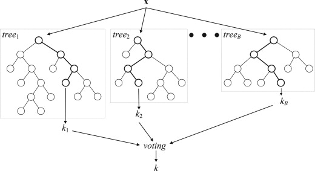

**SVM**
- In machine learning, support vector machines (SVMs, also support vector networks) are supervised learning models with associated learning algorithms that analyze data and recognize patterns, used for classification and regression analysis. Given a set of training examples, each marked as belonging to one of two categories, an SVM training algorithm builds a model that assigns new examples into one category or the other, making it a non-probabilistic binary linear classifier.

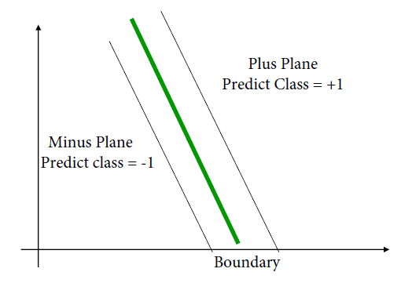

- An SVM model is a representation of the examples as points in space, mapped so that the examples of the separate categories are divided by a clear gap that is as wide as possible. New examples are then mapped into that same space and predicted to belong to a category based on which side of the gap they fall on.
 
**Which**
- The WHICH algorithm implemented was a customised version of the original implementation by Milton to come up with a method which maximises the AUC for Effort and PD.
- WHICH fundamentally work with a concept of '*rules*'
- These *rules* are nothing but combinations of possible feature ranges.
- For our datasets the number of feature ranges was 21.
   * *Step 1:* Data from continuous features then needs to be discretized into “N” equal width bins. For the purpose of this experiment, the number of bins chosen was '5'
   * *Step 2:* WHICH maintains a stack of feature combinations, sorted by a customizable search bias B1. For this study, WHICH used the AUC(effort, pd). <br>
      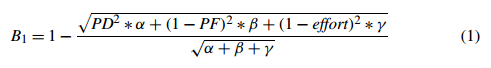
      where, 
            α = 1, β = 1000, γ = 0
      * The (PD,PF, effort) values are normalized to fall between zero and one. 
      * The higher the search bias B1, the better.<br>
Initially, WHICH’s "*rules*" are just each range of each feature. Subsequently, they can grow to two or more features.
   * *Step 3:* Two combinations are picked at random, favoring those combinations that are ranked highly by B1.
   * *Step 4:* The two *rules* are themselves combined, scored based on the , then sorted into the stacked population of prior combinations or rules.
   * *Step 5:* Go to step 4. 
- For this study, 5 iterations were used as the looping termination criteria with 5-fold cross validation
- After the 5 iterations, WHICH returns the highest ranked combination of features
- This combination is then applied on the testing data to find the *defective* modules. Defective modules are ones that satisfy this combination.

# Pseudo Code

```python
def xval(datas,
    m=5,
    n=5,
    learners=[which, nb, dt, rf, svm] # or whatever else you got
 ):
 for data in datas
    for _ in range(m): # m times repeat
    data = shuffle(data)
	for tests in chunks(data, len(data)/n): # data divided into 4 bins
		train = minus( data,  tests)
		god = aucPdPf(tests,  triggered= [ x for x in tests if defective(x) ] )
			for learner in learners
				model = learn(learner, train) 
				mortal = aucPdPf(tests,
                		triggered = [ x for x in tests
                		if satisfies(model,x) 
                        	])
				print(data, learner, mortal / god)

def aucPdPf(tests, triggered=[]):
    loc0 = sum(map(loc,tests))
    bad0 = length(tests)
    auc = loc1 = bad1= 0
    # take all the triggered items, work up in ascending order
    for row in  sort(triggered, key=loc): # ascending order
        if triggered is actually bad:
        	bad1++
        pd = bad1/bad0
        loc1 += row.loc
        ploc = loc1/loc0
        score = pd/ploc
        auc += score
        # after we run out of triggered, go with a straight line (no pd increase)
        rest = minus( tests, triggered )
        for row in  sort(rest, key=loc): # ascending order
           # note: pd no longer updates
            loc1 += row.loc
            ploc = loc1/loc0
            score = pd/ploc
            auc += score
            return auc

def shuffle(lst):
    random.shuffle(lst)
    return lst

def chunks(lst, n):
     #Yield successive n-sized chunks from l.
     for i in xrange(0, len(lst), round(n)):
         yield lst[i:i+n]

def loc(lst):
    return lst[-2] # or wherever you put your loc

def defective(lst):
    klass = lst[-1] # or wherever you put it
    return klass == 'y' # or however you mark defective

def minus(lst1,lst2):
   return list (set(lst1) - set(lst2) )
```
# Results

**Training**

The following are the results obtained after training the datasets being used sorted by their performance

| Dataset  | Random Forest | Decision Tree | SVM    | WHICH  | Naive Bayesian
| ---------|:-------------:| -------------:|--------|:------:|-------:|
| ant      | 0.8196        | 0.6671        | 0.5139 | 0.4186 | 0.2012 |
| camel    | 0.8671        | 0.6292        | 0.4281 | 0.3804 | 0.2003 |
| ivy      | 0.7126        | 0.6504        | 0.4971 | 0.4248 | 0.2303 |
| jedit    | 0.8547        | 0.6133        | 0.4380 | 0.4025 | 0.2096 |
| log4j    | 0.8375        | 0.6603        | 0.4351 | 0.3840 | 0.1966 |
| lucene   | 0.8451        | 0.6281        | 0.4643 | 0.3840 | 0.2318 |
| poi      | 0.8080        | 0.6253        | 0.4012 | 0.3933 | 0.1834 |
| synapse  | 0.8460        | 0.6251        | 0.4925 | 0.4100 | 0.2132 |
| velocity | 0.8027        | 0.5994        | 0.4585 | 0.3780 | 0.2147 |
| xalan    | 0.8022        | 0.6259        | 0.4375 | 0.3542 | 0.2131 |

**Testing**

The following results are based on the recall values computed upon testing the datasets for each of the five models.

| Dataset  | Random Forest | Decision Tree | Naive Bayesian | SVM    | WHICH
| ---------|:-------------:| -------------:|--------------- |:------:|-------:|
| ant      | 0.6315        | 0.438         | 0.5460         | 0.3801 | 0.2843 |
| camel    | 0.4518        | 0.409         | 0.3656         | 0.4754 | 0.2225 |
| ivy      | 0.3235        | 0.1176        | 0.3157         | 0.2105 | 0.145  |
| jedit    | 0.0595        | 0.0330        | 0.0581         | 0.0389 | 0.0235 |
| log4j    | 0.0938        | 0.9523        | 0.9649         | 0.9591 | 0.0875 |
| lucene   | 0.6820        | 0.6615        | 0.8080         | 0.725  | 0.5503 |
| poi      | 0.8215        | 0.7714        | 0.088          | 0.7215 | 0.8116 |
| synapse  | 0.65          | 0.5961        | 0.6119         | 0.65   | 0.2711 |
| velocity | 0.3953        | 0.3953        | 0.4469         | 0.3857 | 0.3088 |
| xalan    | 1             |               | 1              | 1      | 0.9954 |


- Comparing performance of the Learners:
We worked with the above mentioned datasets and the following are the graph plots that show the manualUP, manualDown and the five learners: Random Forest, Naive Bayesian, SVM, Decision Tree and WHICH perform. 

***Ant Dataset***<br>
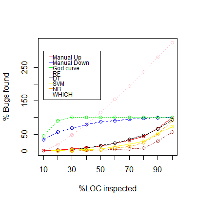

***Camel Dataset***<br>
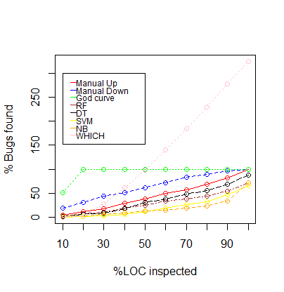

***Ivy Dataset***<br>
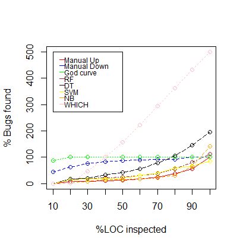

***Jedit Dataset***<br>
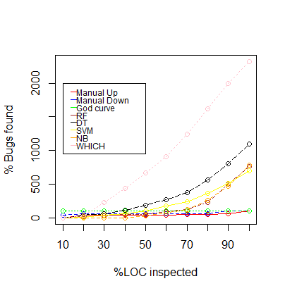

***Log4j Dataset***<br>
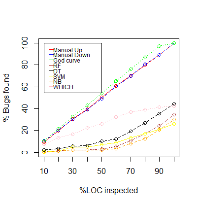

***Lucene Dataset***<br>
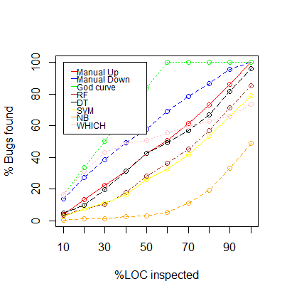

***Poi Dataset***<br>
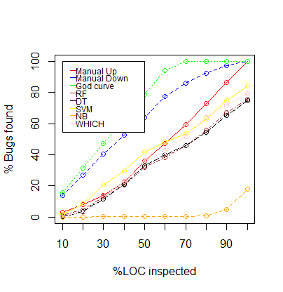

***Synapse Dataset***<br>
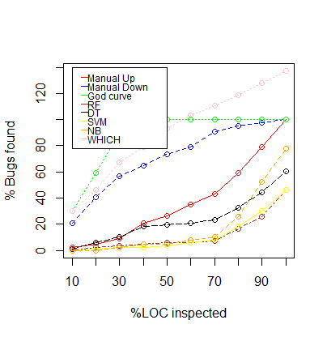

***Velocity Dataset***<br>
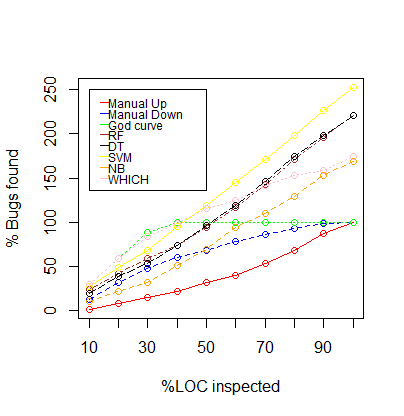

***Xalan Dataset***<br>
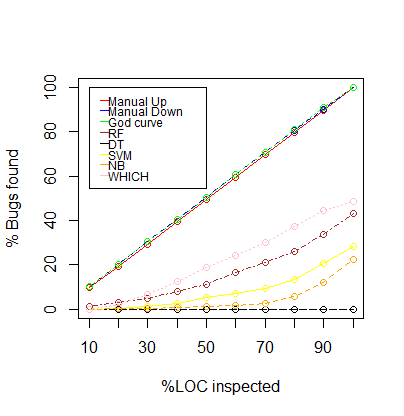


# Discussion

**Hypothesis-1: Smaller modules are buggy**
If this is true, we should see higher auc values for our classifiers (at least the best one). We don't see standard classifiers performing consistently better than y=x line.

**Hypothesis-2: WHICH is better than standard learners**
If this is true, we should see higher auc values for WHICH in most of the datasets. We don't see that happening in any ofthe datasets. It might be an issue inside our code or our logic. It's too early to refute this hypothesis. Like we discussed earlier, it looks more promising in that it uses "pd" and "pf" to optimize rules, and this is missing in standard learners.

**Few more observations**
- WHICH could generate a very simplistic rule containing only 1 attribute. Our code somehow couldn't generate composite rules containing more than 1 attribute. This lead to a very poor model which generated too many false positives. Hence, we see curve for WHICH reaching y-values more than 100 in graphs shown earlier.
- There were a few datasets that had modules containing loc=0 (lines of code = 0). This lead to a few problems in auc calculation as it was leading to divide-by-zero exceptions. We assumed auc value to be zero in these situations.

# Conclusion
Given limited QA resources, one way to substantially increase the quality of any system or software is to utilize these resources to test the most buggy modules. One of ours was to compare five different data mining classifiers (explained in the “Models” section) to prove/disprove if smaller modules are infact the most defective ones. By using ‘loc’ as the feature to rank these modules for each of the datasets, we generated graphs as shown in the ‘Discussion’ section and these prove that the smaller modules were in fact less buggy/defective compared to the larger modules and that this generalization would not hold for types of systems/datasets. 

Additionally, as seen from the 'Results' and the 'Discussion', we can see the hypothesis that 'WHICH' performs better is not significantly right and that the other data mining learners used in our project outperform the 'WHICH' classifier. The 'WHICH' method tries to maximize the AUC value but as it is seen from the graph plots of the 'Results', this method does predict more than the actual number of bugs and hence predicts more false positives. Hence it can be inferred that although this method used more promising techniques, it still does not outperform the standard set of learners. Another important observation has been that this method does not hold the generalization that 'WHICH' performs better on all types of datasets as the tests that we carried out were on different datasets compared to the ones used in ['Defect prediction from static code features: current results, limitations, new approaches.'](http://menzies.us/pdf/10which.pdf).


# Future Work
- The above experiment was carried out using only 9 datasets, to further validate the hypothesis laid out in the paper the analysis could be carried out other datasets of various sizes and features.
- Also, to further investigate the analysis, WHICH2 or WHICH4 could be used as opposed to WHICH5 used in this study.

# References
- http://www.statsoft.com/Textbook/Data-Mining-Techniques
- Menzies, Tim, et al. "Defect prediction from static code features: current results, limitations, new approaches."   Automated Software Engineering 17.4 (2010): 375-407.
- Koru, A. Günes, et al. "Theory of relative defect proneness." Empirical Software Engineering 13.5 (2008): 473-498.
- http://en.wikipedia.org/wiki/Naive_Bayes_classifier
- http://www.saedsayad.com/decision_tree.htm
- http://en.wikipedia.org/wiki/Decision_tree_learning
- https://www.stat.berkeley.edu/~breiman/RandomForests/cc_home.htm#intro
- http://en.wikipedia.org/wiki/Support_vector_machine

## Data source:
http://openscience.us/repo/defect/ck/
